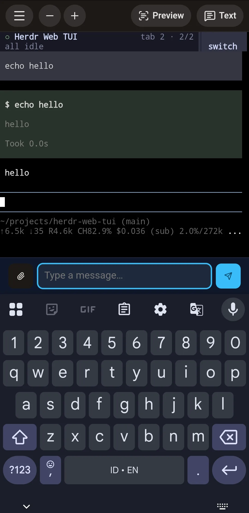

# Herdr Web TUI

Browser access for a running [Herdr](https://herdr.dev/) session, shipped as one
long-running Go daemon with its frontend embedded.

> [!IMPORTANT]
> This project is **not an in-process Herdr plugin**. `herdr-web-tui` is an
> external daemon that wraps Herdr's terminal control surface and listens to the
> Herdr socket for pane/agent events. The included `herdr-plugin.toml` is only an
> optional consumer launcher: Herdr builds the daemon, injects socket context,
> and keeps its foreground process in a managed pane.

## What consumers get

- Live Herdr terminal rendering and input over HTTP + WebSocket.
- Mobile-friendly prompt controls and artifact upload into a pane.
- Installable per-server PWA manifests.
- Single-owner Web Push broadcast to every browser that enables notifications.
- Notification clicks that focus the referenced Herdr pane.
- One binary; no separate frontend server at runtime.

<p align="center">
  
</p>

Herdr remains source of truth for sessions, panes, focus, and agent state. This
daemon does not replace Herdr or embed itself into Herdr's process.

## Option 1: install through Herdr

Best for trying project locally. Requirements: Linux, Herdr 0.7.4+, Git, Go,
Node.js, and npm. Herdr shows manifest/build commands before running them.

```bash
herdr plugin install tigorlazuardi/herdr-web-tui --ref v0.10.0
herdr plugin pane open \
  --plugin tigorlazuardi.herdr-web-tui \
  --entrypoint daemon \
  --env ADDR=127.0.0.1:8080
```

Open <http://127.0.0.1:8080>.

Plugin mode runs daemon in foreground inside managed Herdr tab. Closing that
pane stops daemon. Herdr `[[startup]]` hooks are intentionally not used: plugin
startup hooks are one-shot initialization, not daemon supervisors.

Update or remove managed checkout:

```bash
herdr plugin install tigorlazuardi/herdr-web-tui --ref v0.10.0
herdr plugin uninstall tigorlazuardi.herdr-web-tui
```

Herdr plugin v1 has no separate update command; reinstall refreshes checkout.

## Option 2: run daemon directly

Better for development or existing process supervision:

```bash
npm --prefix frontend ci
npm --prefix frontend run build
go build -o herdr-web-tui ./cmd/herdr-web-tui
HERDR_SOCKET_PATH="$HOME/.config/herdr/herdr.sock" ./herdr-web-tui -addr 127.0.0.1:8080
```

Or use Nix:

```bash
HERDR_SOCKET_PATH="$HOME/.config/herdr/herdr.sock" \
  nix run github:tigorlazuardi/herdr-web-tui/v0.10.0
```

Named Herdr sessions use their own socket under
`~/.config/herdr/sessions/<name>/herdr.sock`.

## Option 3: supervised deployment

Recommended for persistent remote access. Flake exports package and
`homeManagerModules.default`. Run daemon under systemd/Home Manager, set exact
Herdr socket path, then place authenticated HTTPS reverse proxy in front.

Main runtime settings:

| Setting | Default | Purpose |
| --- | --- | --- |
| `ADDR` / `-addr` | `:8080` | HTTP listener; bind loopback behind gateway |
| `HERDR_SOCKET_PATH` | unset | Required for raw Herdr event/focus socket features |
| `TMP_PREFIX` / `-tmp-prefix` | `herdr-web-tui` | `/tmp/<prefix>-<uid>` artifact directory |
| `LOG_FORMAT` / `-log-format` | TTY auto-detect | `json` or `text` |
| `SERVER_NAME` | unset | Stable per-server PWA identity and default app name |
| `APP_NAME` | `SERVER_NAME` | Exact manifest and browser title shown for this instance |
| `FAVICON_PATH` | bundled icon | Absolute path to a 32×32 PNG favicon |
| `PWA_ICON_192_PATH` | bundled icon | Absolute path to a 192×192 PNG install icon |
| `PWA_ICON_512_PATH` | bundled icon | Absolute path to a 512×512 PNG install icon |
| `WEB_PUSH_STORE_PATH` | `./web-push-subscription.json` | Push endpoint store |
| `VAPID_PUBLIC_KEY` | unset | Enables Web Push with matching private config |
| `VAPID_PRIVATE_KEY` | unset | Secret; never expose to browser/logs |
| `VAPID_SUBJECT` | unset | `mailto:` or HTTPS VAPID contact |
| `OTEL_EXPORTER_OTLP_*` | unset | Optional OTLP traces and metrics |

All three VAPID values must be set together. Push registrations contain secrets;
protect store as mode `0600`. See operator guide for migration and rollback.

Give each server stable identity, then optionally choose independent display name:

```nix
services.herdr-web-tui.environment = {
  SERVER_NAME = config.networking.hostName;
  APP_NAME = "Home Lab Shell";
  FAVICON_PATH = "/home/operator/.config/herdr-web-tui/favicon.png";
  PWA_ICON_192_PATH = "/home/operator/.config/herdr-web-tui/icon-192.png";
  PWA_ICON_512_PATH = "/home/operator/.config/herdr-web-tui/icon-512.png";
};
```

Manifest identity derives from `SERVER_NAME`. Manifest `name`, `short_name`, and
browser title use `APP_NAME` exactly, falling back to `SERVER_NAME`. Icon
overrides must be readable absolute paths to PNG files with the exact dimensions
shown above; invalid configuration stops startup. Existing installs may need
reinstallation before launcher text or icons update.

## Security boundary

Daemon intentionally has no built-in TLS, authentication, authorization, or
user identity. Gateway must own TLS and access controls. Requests reaching daemon
are trusted. Bind to loopback and do **not** expose raw listener directly to LAN
or internet.

Herdr plugins are ordinary unsandboxed code running as consumer's user. Review
`herdr-plugin.toml` before install. Production users should prefer supervised
Nix/systemd deployment over plugin-pane launcher.

## Architecture

```text
browser/PWA
    │ HTTP + WebSocket
    ▼
herdr-web-tui daemon
    ├─ wraps Herdr terminal CLI/session stream
    ├─ listens to Herdr socket events
    └─ sends pane focus requests through Herdr socket
            │
            ▼
       Herdr server
```

## Documentation

- [Operator / deploy guide](docs-site/src/content/docs/guides/operator-deploy-guide.mdx)
- [Endpoint reference](docs-site/src/content/docs/reference/endpoints.mdx)
- [Herdr plugin publishing](https://herdr.dev/docs/plugins/)
- [Herdr plugin marketplace](https://herdr.dev/docs/marketplace/)

Build docs locally with `cd docs-site && npm ci && npm run build`.

## License

[MIT](LICENSE)
